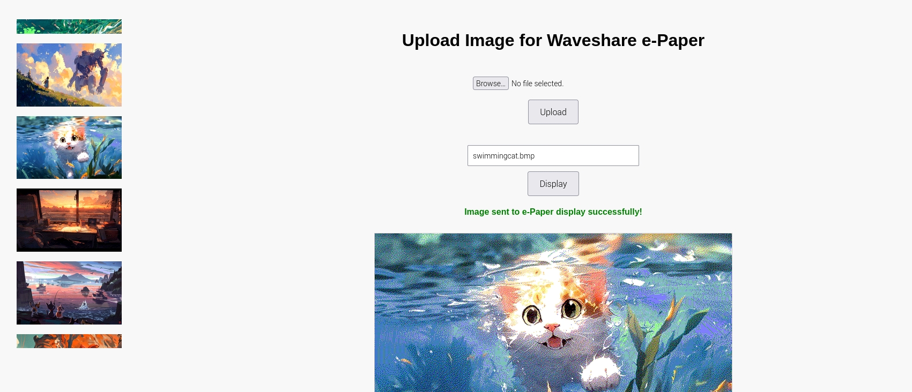

# E-ink-Display-WebUI

# 🖼️ E-ink Display Web UI for Raspberry Pi

This project provides a lightweight and user-friendly web interface for uploading and displaying images on a **Waveshare e-Paper display** connected to a Raspberry Pi.

You can upload images (or extract frames from videos) via a browser and have them automatically shown on the e-Paper screen.

---

## 🌐 Web UI Preview

---

## 🔧 Features

- Upload and preview images via browser
- Convert uploaded files to e-Paper compatible format
- One-click display update to your e-Ink panel
- Image history sidebar for quick reuse
- Plug-and-play on Raspberry Pi with GPIO-connected Waveshare displays

---

## 📦 Supported Hardware

- Raspberry Pi (any model with GPIO and Python 3)
- **Waveshare e-Paper display**

> ⚠️ You must download the correct driver files that match the resolution of your display.

📌 Refer to the official Waveshare e-Paper GitHub repo:  
👉 [https://github.com/waveshare/e-Paper](https://github.com/waveshare/e-Paper)

Make sure to use the correct Python module for your display (e.g., `epd7in5_V2`, `epd2in13_V3`, etc.) in your script.

---
